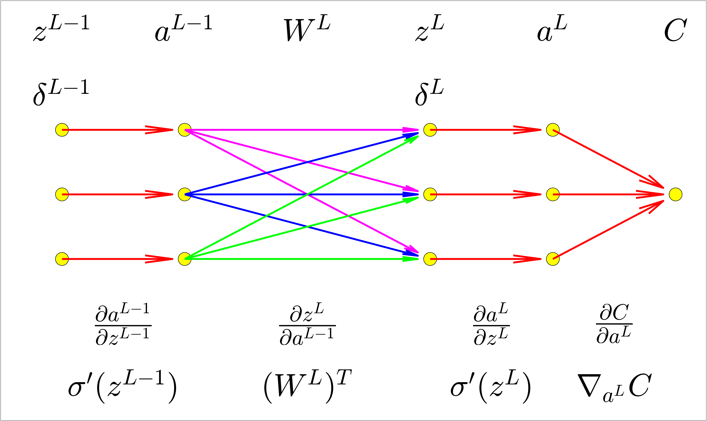
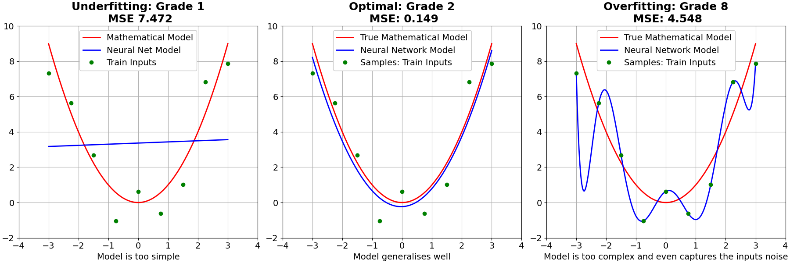

# Gradient Descent Algorithms

- Batch Gradient Descent.
- Stochastic Gradient Descent.
- Mini-Bach Gradient Descent.

# Derivatives on Computational Graphs

$\frac{\partial{Z}}{\partial{X}} \rightarrow$ Sum over all possible paths between node $X$ and node $Z$, multiplying the derivatives on each edge of the path together.

<!--  -->

## *Net feed forward Matrix Dimensions*

<!--  -->
<!--  -->

## *Feed forward activations: Single Neuron*

$$a^{l}_j = \sigma \bigg( \sum_k w^l _{jk} a^{l-1}_k + b^l_j \bigg)$$

$w_{jk}$ denote the weight for the connection from the $k \textrm{  } neuron$ in the $(l−1)$ layer to the $j \textrm{  } neuron$ in the layer $l$.

## *Feed forward activation: Vectorized form*

$$a^l = \sigma \bigg( W^la^{l-1}+b^l \bigg)$$

## *Cost function* $MSE$

$$C(w,b) = \frac{1}{n} \sum_x || y(x) - a^L||^2 $$

## *Gradient vector of the cost function*

$$TrainingInputs=x_1, x_2, \ldots,x_n$$

$$MiniBatches=[X_1, X_2, \ldots,X_m],[X_1, X_2, \ldots,X_m]...$$

$$\nabla C =  \frac{1}{n}\sum_{x=1}^n\nabla C_x \approx \frac{1}{m} \sum_{j=1}^m \nabla C_{X_{j}} $$

$$\nabla C \approx \frac{1}{m} \sum_{j=1}^m \nabla C_{X_{j}}$$

## *Update W,b using Gradient Descent*

$$w_k \rightarrow  w_k-\eta \frac{\partial C}{\partial w_k}$$

$$b_l \rightarrow  b_l-\eta \frac{\partial C}{\partial b_l}$$

## *Update W,b using Stochastic Gradient Descent with Mini-Batches*

$$w_k \rightarrow  w_k-\frac{\eta}{m}\sum_j \frac{\partial C_{X_j}}{\partial w_k}$$

$$b_l \rightarrow b_l-\frac{\eta}{m}\sum_j \frac{\partial C_{X_j}}{\partial b_l}$$

## *Backpropagation*

Backpropagation compute:
- The partial derivatives $\partial C_x/ \partial W^l$ and $\partial C_x/ \partial b^l$ for a single training input. We then recover $\partial C/ \partial W^l$ and $\partial C/ \partial b^l$ averaging training examples on the mini bach.

- $Error$ $\delta^l$ and then will relate  $\delta^l$ to $\partial C/ \partial W^l$ and $\partial C/ \partial b^l$.

- Weight and Biases will learn slowly if:
  - The input neuron is low-activation $\rightarrow a^{l-1}_k$.
  - The output neuron has saturated $\rightarrow \sigma'(z^l)$

<!-- $$ \frac{\partial C}{\partial w^L_{jk}} =  
                                              \underbrace{\frac{\partial C}{\partial a^L_{j}} 
                                              \frac{\partial a^L_{j}}{\partial z^L_{j}}}_{\delta^L_j}
                                              \frac{\partial z^L_{j}}{\partial w^L_{jk}}
                                              =\delta^L_j a^{L-1}_{k}
                                              $$

$$ \frac{\partial C}{\partial b^L_{j}} =  
                                          \underbrace{\frac{\partial C}{\partial a^L_{j}} 
                                          \frac{\partial a^L_{j}}{\partial z^L_{j}}}_{\delta^L_j}
                                          \frac{\partial z^L_{j}}{\partial b^L_{j}}
                                          =\delta^L_j
                                          $$ -->

- Backpropagation Equations:

$$
\begin{align}
    & \delta^L = \frac{\partial C}{\partial z^L}\\
    & \\  
    & \delta^L = \nabla_{a^L} C \odot \sigma'(z^L) \\
    & \\
    & \delta^l   = ([W^{l+1}]^T \delta^{l+1}) \odot \sigma'(z^l) \\
    & \\
    & \frac{\partial C}{\partial W^l} = \delta^l [a^{l-1}]^T\\
    & \\
    & \frac{\partial C}{\partial b^l} =\delta^l \\
\end{align}
$$

- Gradient Descent Combined with Backpropagation

$$
\begin{align}
  & W^l \rightarrow W^l -\frac{\eta}{m} \sum^m_x \delta^l_x [a^{l-1}_x]^T\\
  & \\
  & b^l \rightarrow b^l -\frac{\eta}{m} \sum^m_x \delta^l_x
\end{align}
$$

- Chain rule applied in Backpropagation

## *Cross entropy cost function: Avoid slow training*

$$
 a=a^L =\sigma(z^L)\\
$$
- Functions <b>Cuadratic</b> $MSE$  and <b>Cross-Entropy</b> $CE$ 

$$
\begin{align} 
  & C_{MSE}  = \frac{1}{2n} \sum_x (y-a)^2\\
  & \\
  & C_{CE}  = -\frac{1}{n} \sum_x [y \ln(a)+ (1-y) \ln(1-a)]\\  
\end{align}
$$

- Derivatives

$$
\begin{align} 
  & \frac{\partial C_{MSE}}{\partial w}  = (a^L-y)\sigma'(z^L)\\
  & \\
  & \frac{\partial C_{CE}}{\partial w}  = (a^L-y)a^{L-1}
\end{align}
$$

When the weights are updated using the CE cost function it does not matter if the neurons are saturated $\sigma'(z^L) \approx 0$ since the derivative term is avoided. The rate at which the weight learns is controlled by the error $(\sigma(z^L)-y)$. The larger the error, the faster the neuron will learn. The cross-entropy function is demonstrated from the following equations.

$$
\begin{align} 
  & \sigma(z)   =1/(1+e^{-z})\\
  & \\
  & \sigma'(z)  =\sigma(z)(1-\sigma(z))
\end{align}
$$

- Softmax: The activation function of the last layer can be thought of as a probability distribution. It can be useful with classification problems  involving disjoint classes.

$$
\begin{align} 
  & a^L_j = \frac{e^{z^L_j}}{\sum e^{z^L_j}}\\
  & \\
  & \sum a^L_j = 1
\end{align}
$$

## *Regularization: Decrease overfitting and Generalise better*

The effectis to make it so the network prefers to learn small weights.  Large weights will only be allowed if they considerably improve the first part of the cost function.  Regularization can be viewed as a way of compromising between finding small weights and minimizing the original cost function. The relative importance of the two elements of the compromise depends on the value of $\lambda$. When $\lambda$ is small we prefer to minimize the original cost function, but when $\lambda$ is large we prefer small weights.

$L1:$
  
$$
\begin{aligned} 
   & C = C_0 +   \underbrace{ \frac{\lambda}{n} \sum_w |w| }_{L1}\\
\end{aligned}
$$

$$
\begin{aligned} 
   & C_{CE}  = -\frac{1}{n} \sum_{x}\sum_{j} \left[ y_j \ln a^L_j+(1-y_j) \ln(1-a^L_j)\right] + L1\\
   & \\
   &  C_{MSE} = \frac{1}{2n} \sum_x ||y-a^L||^2 +L1\\
\end{aligned}
$$

$L2:$

$$
\begin{align} 
   & C = C_0 +  \underbrace{ \frac{\lambda}{2n}\sum_w w^2}_{L2} \\
\end{align}
$$

$$
\begin{align} 
   & C_{CE}  = -\frac{1}{n} \sum_{x}\sum_{j} \left[ y_j \ln a^L_j+(1-y_j) \ln(1-a^L_j)\right] + L2\\
   & \\
   & C_{MSE} = \frac{1}{2n} \sum_x ||y-a^L||^2 + L2\\
\end{align}
$$

Regularized networks are constrained to build relatively simple models based on patterns seen often in the training data, and are resistant to learning peculiarities of the noise in the training data.Thus, regularised neural networks tend to generalise better than non-regularised ones.

## *Regularization and gradient descent*

The dynamics of gradient descent learning in multilayer nets has a ``self-regularization effect´´.

$L1:$

$$
\begin{align}
  & C = C_0 + \frac{\lambda}{n}\sum_w |w| \\
  & \\
  & \frac{\partial C}{\partial w} = \frac{\partial C_0}{\partial w} + \frac{\lambda}{n} sgn(w) \\ 
  & \\
  & w \rightarrow w- \frac{\eta}{m}\sum_j \frac{\partial C_{X_j}}{\partial w}\\
  & w \rightarrow w- \frac{\eta \lambda}{n} sgn(w) - \frac{\eta}{m}\sum_j \frac{\partial C_{X_j}}{\partial w} \\
\end{align}
$$

$L2:$

$$
\begin{align}
  & C = C_0 + \frac{\lambda}{2n}\sum w^2 \\
  & \\
  & \frac{\partial C}{\partial w} = \frac{\partial C_0}{\partial w} + \frac{\lambda}{n} w \\ 
  & \\
  & w \rightarrow w- \frac{\eta}{m}\sum_j \frac{\partial C_{X_j}}{\partial w} \\
  & \\
  & w \rightarrow w-\frac{\eta \lambda}{n}w -\frac{\eta}{m} \sum_j \frac{\partial C_{X_j}}{\partial w}\\
\end{align}
$$

When a particular weight has a large magnitude $|w|$, $L2$ regularization shrinks the weight much more than $L1$ regularization does. When  $|w|$ is small, L1 regularization shrinks the weight much more than L2 regularization. 

## *Dropout*

The dropout procedure is like averaging the effects of a very large number of different networks. The different networks will overfit in different ways, and so, hopefully, the net effect of dropout will be to reduce overfitting.

If we think of our network as a model which is making predictions, then we can think of dropout as a way of making sure that the model is robust to the loss of any individual piece of evidence. In this, it's somewhat similar to L1 and L2 regularization, which tend to reduce weights, and thus make the network more robust to losing any individual connection in the network

## *References*

[Deriving the Backpropagation Equations from Scratch (Part 1)](https://towardsdatascience.com/deriving-the-backpropagation-equations-from-scratch-part-1-343b300c585a)

[Deriving the Backpropagation Equations from Scratch (Part 2)](https://towardsdatascience.com/deriving-the-backpropagation-equations-from-scratch-part-2-693d4162e779)

[Neural Networks and Deep Learning](http://neuralnetworksanddeeplearning.com/)

[Backpropagation from the beginning](https://medium.com/@erikhallstrm/backpropagation-from-the-beginning-77356edf427d)

[Backpropagation calculus](https://www.3blue1brown.com/lessons/backpropagation-calculus)

