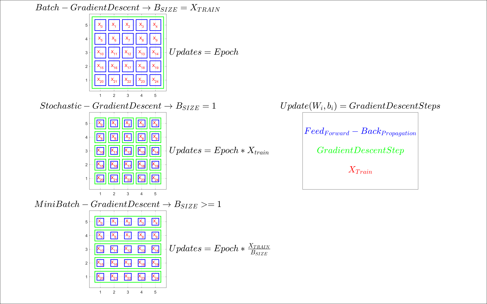
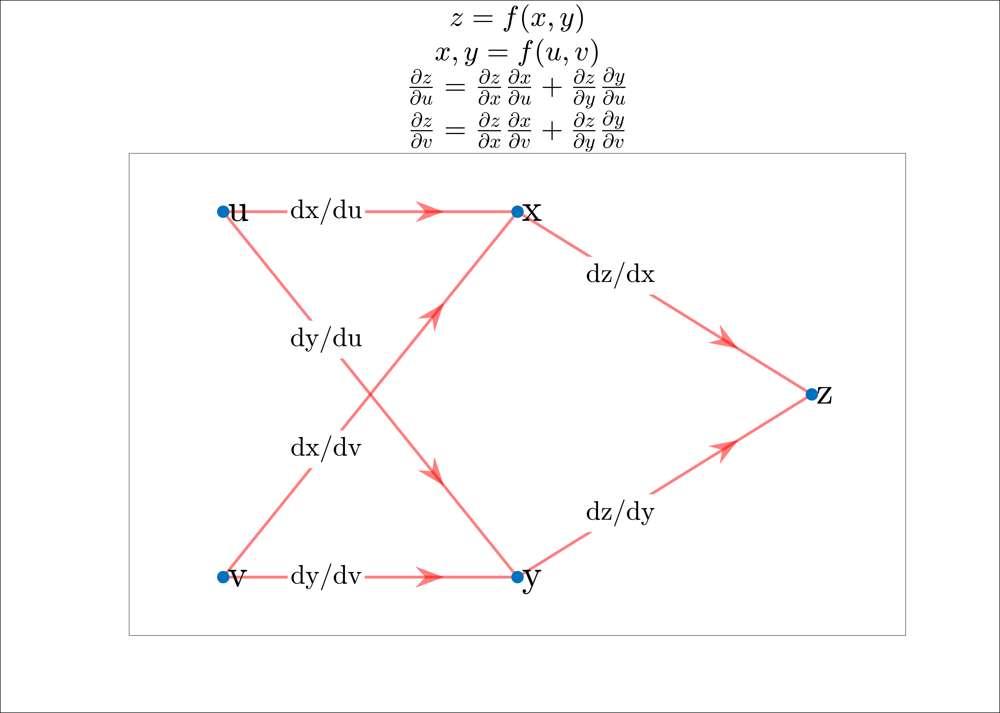
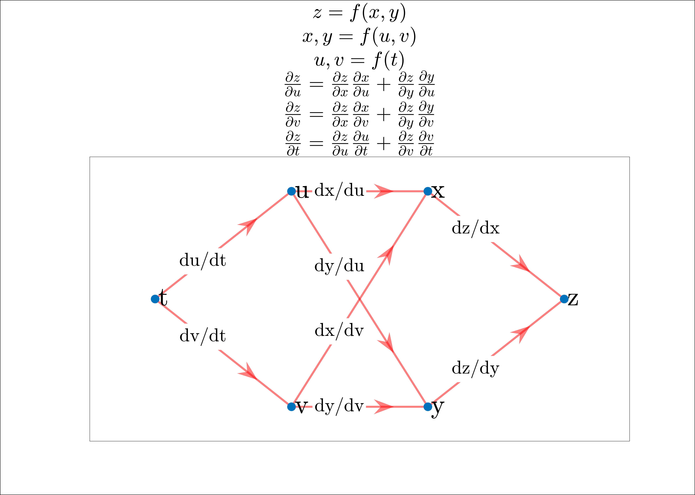
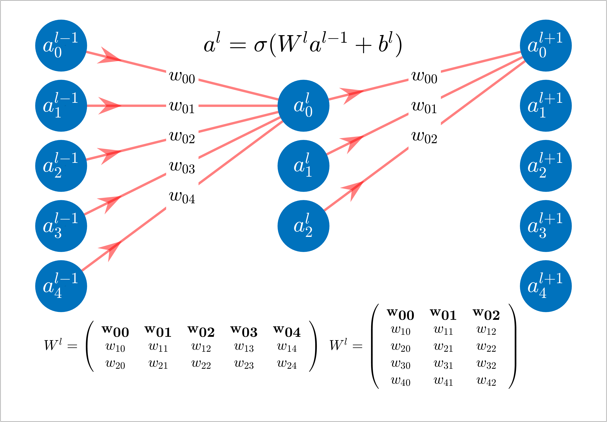
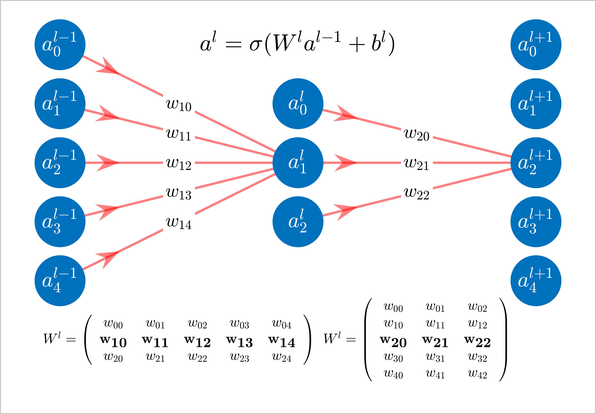
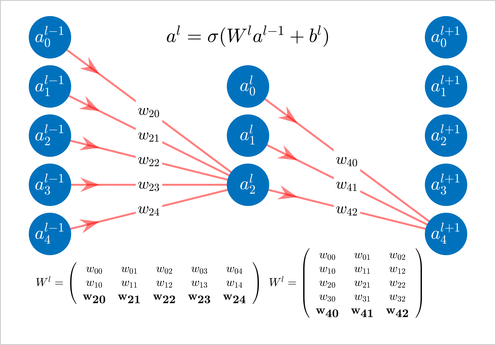

# Gradient Descent Algorithms

- Batch Gradient Descent.
- Stochastic Gradient Descent.
- Mini-Bach Gradient Descent.

# Derivatives on Computational Graphs

$\frac{\partial{Z}}{\partial{X}} \rightarrow$ Sum over all possible paths between node $X$ and node $Z$, multiplying the derivatives on each edge of the path together.

## *Net feed forward*

## *Feed forward activations: Single Neuron*

$$a^{l}_j = \sigma \bigg( \sum_k w^l _{jk} a^{l-1}_k + b^l_j \bigg)$$

$w_{jk}$ denote the weight for the connection from the $k \textrm{  } neuron$ in the $(l−1)$ layer to the $j \textrm{  } neuron$ in the layer $l$.

## *Feed forward activation: Vectorized form*

$$a^l = \sigma \bigg( W^la^{l-1}+b^l \bigg)$$

## *Cost function* $MSE$

$$C(w,b) = \frac{1}{n} \sum_x || y(x) - a^L||^2 $$

## *Gradient vector of the cost function*

$$TrainingInputs=x_1, x_2, \ldots,x_n$$

$$MiniBatches=[X_1, X_2, \ldots,X_m],[X_1, X_2, \ldots,X_m]...$$

$$\frac{1}{m} \sum_{j=1}^m \nabla C_{X_{j}} \approx \frac{1}{n}\sum_{x=1}^n\nabla C_x = \nabla C$$

$$\nabla C \approx \frac{1}{m} \sum_{j=1}^m \nabla C_{X_{j}}$$

## *Update W,b using Gradient Descent*

$$w_k \rightarrow w_k' = w_k-\eta \frac{\partial C}{\partial w_k}$$

$$b_l \rightarrow b_l' = b_l-\eta \frac{\partial C}{\partial b_l}$$

## *Update W,b using Stochastic Gradient Descent with Mini-Batches*

$$w_k \rightarrow w_k' = w_k-\frac{\eta}{m}\sum_j \frac{\partial C_{X_j}}{\partial w_k}$$

$$b_l \rightarrow b_l' = b_l-\frac{\eta}{m}\sum_j \frac{\partial C_{X_j}}{\partial b_l}$$

## Backpropagation Equations

Backpropagation compute:
- The partial derivatives $\partial C_x/ \partial w_{jk}^l$ and $\partial C_x/ \partial b_j^l$ for a single training input. We then recover $\partial C/ \partial w_{jk}^l$ and $\partial C/ \partial b_j^l$ by averaging over training examples.

- $error$ $\delta^l_j$ and then will relate  $\delta^l_j$ to $\partial C/ \partial w_{jk}^l$ and $\partial C/ \partial b_j^l$.

 $$
   \delta^L_j = \frac{\partial C}{\partial z^L_{j}}
  $$

$$ \frac{\partial C}{\partial w^L_{jk}} =  \underbrace{\frac{\partial C}{\partial a^L_{j}} 
                                           \frac{\partial a^L_{j}}{\partial z^L_{j}}}_{\delta^L_j}
                                           \frac{\partial z^L_{j}}{\partial w^L_{jk}}
                                           =\delta^L_j a^{L-1}_{k}
                                           $$
$$ \frac{\partial C}{\partial b^L_{j}} =  \underbrace{\frac{\partial C}{\partial a^L_{j}} 
                                           \frac{\partial a^L_{j}}{\partial z^L_{j}}}_{\delta^L_j}
                                           \frac{\partial z^L_{j}}{\partial b^L_{j}}
                                           =\delta^L_j
                                           $$

$$

\begin{align}   
    & \delta^L_j = \frac{\partial C}{\partial a^L_j} \sigma'(z^L_j) \rightarrow \delta^L = \nabla_{a^L} C \odot \sigma'(z^L)\\
    & \delta^l   = ((W^{l+1})^T \delta^{l+1}) \odot \sigma'(z^l)\\
    & \frac{\partial C}{\partial b^l_j} =\delta^l_j \\
    & \frac{\partial C}{\partial w^l_{jk}} =  a^{l-1}_k \delta^l_j
\end{align}

$$

Weight will learn slowly if:
- The input neuron is low-activation $(4)\rightarrow a^{l-1}_k$.
- The output neuron has saturated $(1)\rightarrow \sigma'(z^l)$

