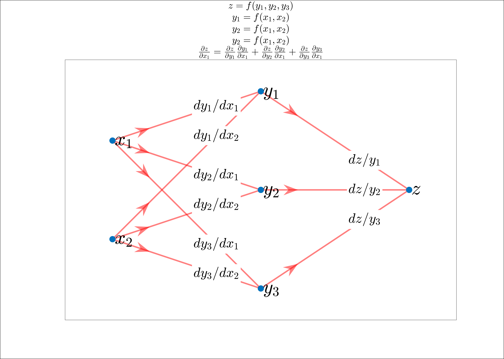

## Gradient Descent Algorithms

- Batch Gradient Descent.
- Stochastic Gradient Descent.
- Mini-Bach Gradient Descent.

## Derivatives on Computational Graphs

$\frac{\partial{Z}}{\partial{X}} \rightarrow$ Sum over all possible paths between node $X$ and node $Z$, multiplying the derivatives on each edge of the path together.

